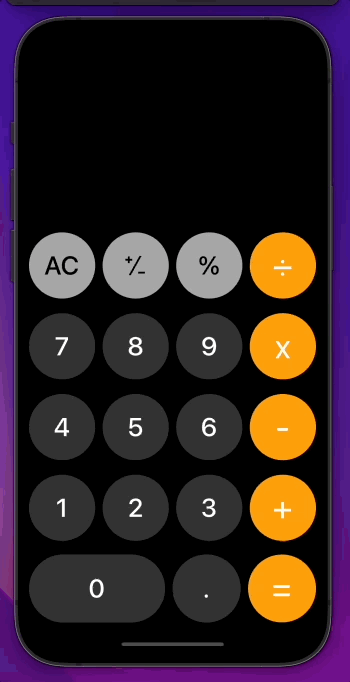

# Calculator app
Standart iOS calculator app written without storyboard - elements placed only by using code.  
FUN FACT - you can download it and install it on your iPad, in that case, you will have a calculator app on Ipad 😎.  

## Demo

 

## Description

This app is almost a 1:1 copy of the original iOS calculator app.  
I have tried to recreate UI and all functionality (only in portrait mode).  
All operations that can be done on original app user can also do here.   

UI have been desinged fully using code files.    

Made with ♥️ in Swift.
